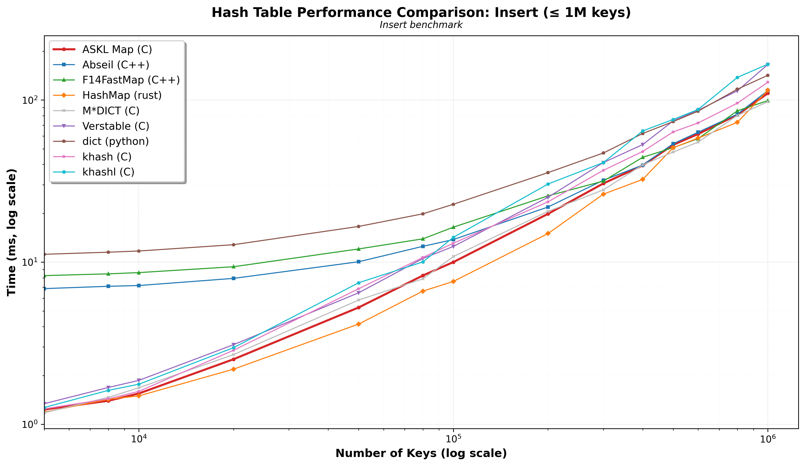
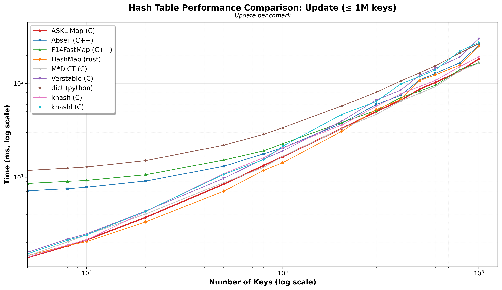
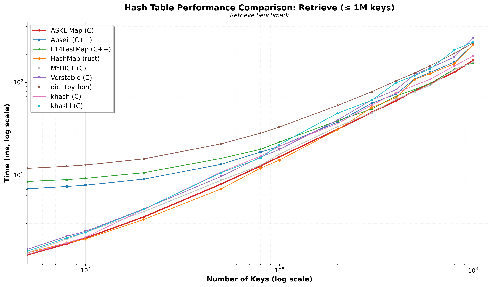
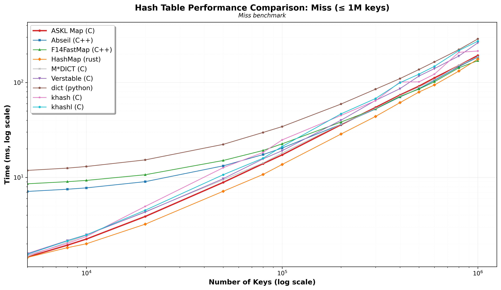
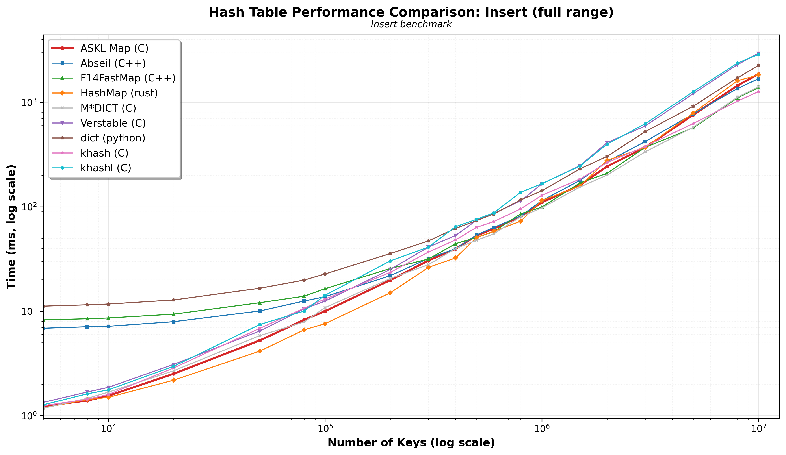
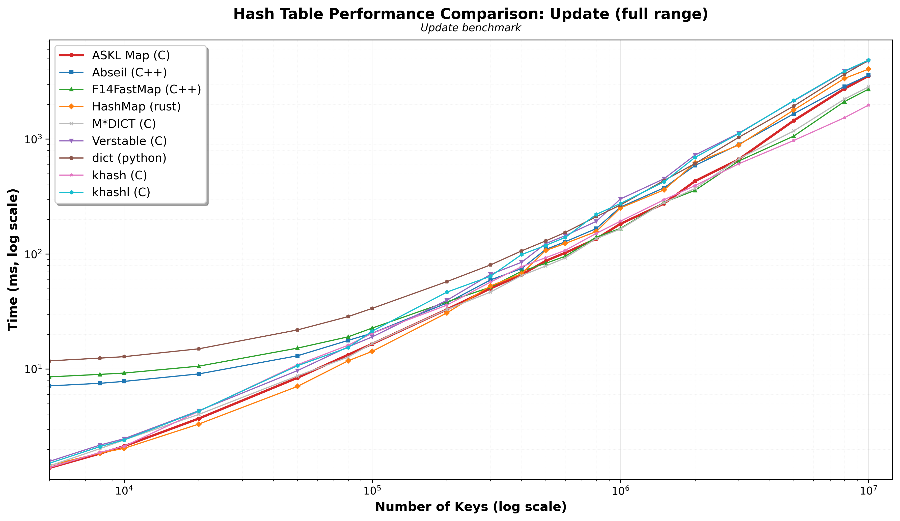
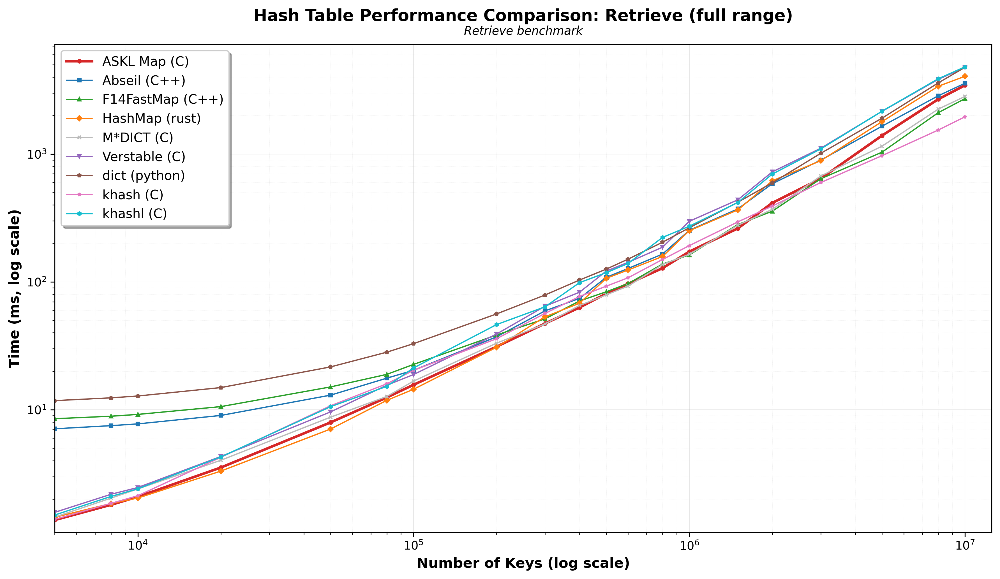
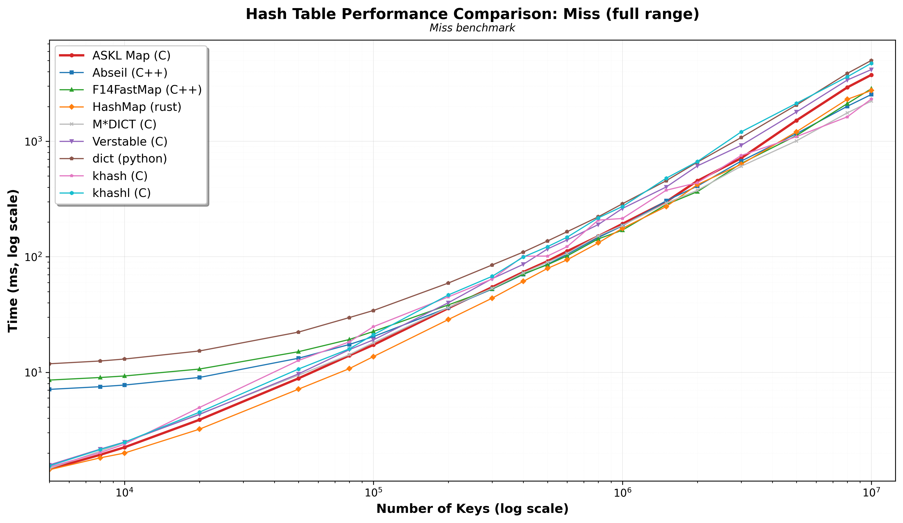

# Hashmap benchmark report

This benchmark pits my own hash map implementation, [ASKL](https://github.com/RaphaelPrevost/ASKL), against what I hope is a representative sample of the state of the art:
- Abseil, written in C++ and SwissTable-based
- F14 FastMap, written in C++ and optimised for raw speed
- Rust's standard library HashMap, based on hashbrown
- M*DICT, a high quality hash map written in C
- Verstable, Jackson Allan's implementation in C
- the Python dictionary, which is written in C under the hood
- khash, probably the most famous C hash map, and its descendant khashl

What does ASKL bring to the table? Like all the strong contenders above, it's portable, but it's also thread-safe, comes with an iterator and stable traversal order, and a fun lazy sort feature. It's a hybrid beast somewhat similar to Java's LinkedHashMap.

My own focus is fast retrieval of pointer values from a string key, so that's the performance aspect
I have optimised ASKL for and what this simple benchmark tries to evaluate.

I have measured four different workloads:
- insert simply inserts "1" to "N" keys with integer values in the map
- update inserts the same data in the map, then update all the values
- retrieve inserts data, then read the values back (the one I care the most about)
- miss inserts data, then purposefully lookup non-existing keys.

The numbers provided here come from my own machine, a M2 Max, and were gathered using hyperfine.
All the timings are wall-clock medians in milliseconds, lower is better.
Not all implementations have some "reserve" feature, so I have not used it for those who do.
I have chosen to use each implementation "as-is" including their default hash function, because that's how a developer using the various libraries would experience them. ASKL uses rapidhashNano.

## Outputs

- `all-benchmarks.csv`: full aggregated dataset
- `all-benchmarks-under-1m.csv`: aggregated dataset restricted to `keys <= 1_000_000`
- `insert.csv`, `update.csv`, `retrieve.csv`, `miss.csv`: full per-test CSVs
- `insert-under-1m.csv`, `update-under-1m.csv`, `retrieve-under-1m.csv`, `miss-under-1m.csv`: zoomed per-test CSVs

## Zoomed report: ≤ 1M keys

My own use case involves a moderate amount of data, usually between a few thousand and a few hundred thousand key/value pairs, so I have paid special attention to this range of values.

### Insert ≤ 1M keys

|    keys |   ASKL Map (C) |   Abseil (C++) |   F14FastMap (C++) |   HashMap (rust) |   M*DICT (C) |   Verstable (C) |   dict (python) |   khash (C) |   khashl (C) |
|--------:|---------------:|---------------:|-------------------:|-----------------:|-------------:|----------------:|----------------:|------------:|-------------:|
|    5000 |          1.233 |          6.864 |              8.258 |            1.187 |        1.177 |           1.339 |          11.179 |       1.245 |        1.268 |
|    8000 |          1.396 |          7.096 |              8.467 |            1.426 |        1.465 |           1.686 |          11.514 |       1.435 |        1.619 |
|   10000 |          1.548 |          7.173 |              8.619 |            1.496 |        1.679 |           1.865 |          11.712 |       1.595 |        1.766 |
|   20000 |          2.517 |          7.938 |              9.369 |            2.186 |        2.689 |           3.096 |          12.81  |       2.86  |        2.967 |
|   50000 |          5.253 |         10.054 |             12.062 |            4.15  |        5.839 |           6.473 |          16.604 |       6.854 |        7.461 |
|   80000 |          8.269 |         12.516 |             13.922 |            6.627 |        7.886 |          10.525 |          19.862 |      10.686 |       10.03  |
|  100000 |         10.005 |         13.777 |             16.428 |            7.602 |       10.824 |          12.499 |          22.741 |      13.082 |       14.218 |
|  200000 |         19.856 |         21.881 |             25.638 |           15.008 |       20.561 |          25.123 |          35.659 |      23.552 |       30.325 |
|  300000 |         30.584 |         32.01  |             31.616 |           26.276 |       27.924 |          41.137 |          47.137 |      36.858 |       41.146 |
|  400000 |         39.507 |         39.688 |             44.322 |           32.382 |       39.81  |          53.098 |          62.154 |      48.148 |       64.469 |
|  500000 |         52.905 |         53.738 |             50.867 |           50.774 |       47.79  |          74.321 |          73.622 |      63.582 |       75.85  |
|  600000 |         61.694 |         63.295 |             57.76  |           58.19  |       55.004 |          86.408 |          85.378 |      72.151 |       87.425 |
|  800000 |         81.046 |         81.782 |             85.769 |           72.852 |       80.364 |         113.923 |         116.611 |      95.649 |      137.94  |
| 1000000 |        110.103 |        114.378 |             99.125 |          114.859 |       97.564 |         165.691 |         142.11  |     128.776 |      166.213 |

As you can see, Rust's HashMap crushes everyone here. I essentially compete with M*DICT, but Abseil and Folly close the gap as we reach 1 million keys.

### Update ≤ 1M keys

|    keys |   ASKL Map (C) |   Abseil (C++) |   F14FastMap (C++) |   HashMap (rust) |   M*DICT (C) |   Verstable (C) |   dict (python) |   khash (C) |   khashl (C) |
|--------:|---------------:|---------------:|-------------------:|-----------------:|-------------:|----------------:|----------------:|------------:|-------------:|
|    5000 |          1.38  |          7.132 |              8.542 |            1.449 |        1.435 |           1.572 |          11.777 |       1.387 |        1.514 |
|    8000 |          1.841 |          7.512 |              8.985 |            1.857 |        2.029 |           2.181 |          12.437 |       1.883 |        2.115 |
|   10000 |          2.131 |          7.801 |              9.222 |            2.042 |        2.416 |           2.475 |          12.805 |       2.128 |        2.416 |
|   20000 |          3.708 |          9.066 |             10.586 |            3.318 |        4.028 |           4.335 |          14.986 |       4.279 |        4.308 |
|   50000 |          8.391 |         13.034 |             15.194 |            7.057 |        8.714 |           9.689 |          21.876 |      10.89  |       10.682 |
|   80000 |         13.312 |         17.736 |             19.054 |           11.787 |       12.692 |          15.584 |          28.57  |      16.102 |       15.375 |
|  100000 |         16.545 |         20.505 |             22.705 |           14.237 |       16.66  |          19.017 |          33.681 |      20.438 |       21.354 |
|  200000 |         32.973 |         37.461 |             38.353 |           30.759 |       32.926 |          39.568 |          57.581 |      35.943 |       46.652 |
|  300000 |         50.221 |         59.576 |             51.56  |           52.843 |       46.713 |          66.494 |          80.485 |      57.115 |       64.117 |
|  400000 |         66.175 |         74.761 |             70.829 |           67.435 |       65.001 |          84.837 |         106.534 |      77.58  |       98.967 |
|  500000 |         87.143 |        109.548 |             82.913 |          107.458 |       78.611 |         123.05  |         130.011 |      92.902 |      118.87  |
|  600000 |        102.57  |        127.944 |             95.696 |          123.574 |       92.479 |         144.608 |         154.17  |     107.71  |      139.494 |
|  800000 |        135.5   |        166.471 |            140.312 |          156.955 |      136.243 |         192.371 |         211.337 |     151.195 |      221.291 |
| 1000000 |        182.896 |        255.819 |            166.844 |          251.627 |      164.85  |         301.03  |         266.861 |     192.885 |      274.933 |

Same story for updates, except khash and khashl get closer as we approach the million.

### Retrieve ≤ 1M keys

|    keys |   ASKL Map (C) |   Abseil (C++) |   F14FastMap (C++) |   HashMap (rust) |   M*DICT (C) |   Verstable (C) |   dict (python) |   khash (C) |   khashl (C) |
|--------:|---------------:|---------------:|-------------------:|-----------------:|-------------:|----------------:|----------------:|------------:|-------------:|
|    5000 |          1.373 |          7.098 |              8.511 |            1.442 |        1.447 |           1.577 |          11.788 |       1.389 |        1.502 |
|    8000 |          1.807 |          7.51  |              8.901 |            1.849 |        2.038 |           2.183 |          12.394 |       1.854 |        2.101 |
|   10000 |          2.086 |          7.752 |              9.196 |            2.039 |        2.401 |           2.465 |          12.81  |       2.126 |        2.407 |
|   20000 |          3.532 |          9.025 |             10.581 |            3.312 |        4.027 |           4.306 |          14.907 |       4.246 |        4.273 |
|   50000 |          7.959 |         13.008 |             15.085 |            7.065 |        8.748 |           9.62  |          21.633 |      10.742 |       10.568 |
|   80000 |         12.477 |         17.662 |             18.913 |           11.841 |       12.71  |          15.564 |          28.208 |      15.971 |       15.247 |
|  100000 |         15.675 |         20.354 |             22.628 |           14.46  |       16.755 |          18.85  |          32.875 |      20.337 |       21.234 |
|  200000 |         31.143 |         37.182 |             38.412 |           30.816 |       33.17  |          39.09  |          56.158 |      35.927 |       46.356 |
|  300000 |         47.304 |         59.405 |             51.462 |           53.371 |       46.891 |          64.604 |          79.033 |      56.76  |       63.889 |
|  400000 |         63.07  |         74.317 |             70.913 |           68.105 |       65.389 |          83.073 |         103.423 |      76.91  |       98.674 |
|  500000 |         80.963 |        108.579 |             83.709 |          106.757 |       79.168 |         121.512 |         125.86  |      92.581 |      118.105 |
|  600000 |         96.783 |        127.349 |             96.983 |          123.87  |       92.713 |         142.162 |         150.677 |     107.738 |      139.372 |
|  800000 |        128.07  |        165.051 |            137.946 |          158.142 |      136.673 |         186.874 |         204.296 |     149.764 |      222.856 |
| 1000000 |        172.453 |        253.046 |            162.484 |          251.434 |      164.413 |         297.769 |         265.096 |     192.116 |      272.465 |

That's what I worked for. I'm elbowing Rust here, but Folly and M*DICT come back for the million.

### Miss ≤ 1M keys

|    keys |   ASKL Map (C) |   Abseil (C++) |   F14FastMap (C++) |   HashMap (rust) |   M*DICT (C) |   Verstable (C) |   dict (python) |   khash (C) |   khashl (C) |
|--------:|---------------:|---------------:|-------------------:|-----------------:|-------------:|----------------:|----------------:|------------:|-------------:|
|    5000 |          1.451 |          7.12  |              8.569 |            1.435 |        1.469 |           1.579 |          11.858 |       1.514 |        1.549 |
|    8000 |          1.933 |          7.508 |              9.02  |            1.819 |        2.081 |           2.163 |          12.532 |       2.018 |        2.148 |
|   10000 |          2.242 |          7.758 |              9.297 |            2     |        2.463 |           2.49  |          13.032 |       2.385 |        2.48  |
|   20000 |          3.881 |          9.026 |             10.673 |            3.217 |        4.361 |           4.316 |          15.302 |       4.955 |        4.515 |
|   50000 |          8.863 |         13.238 |             15.08  |            7.145 |        9.431 |           9.695 |          22.289 |      12.66  |       10.675 |
|   80000 |         13.972 |         17.415 |             19.237 |           10.759 |       14.206 |          15.693 |          29.776 |      18.337 |       15.944 |
|  100000 |         17.273 |         20.385 |             22.59  |           13.688 |       18.067 |          19.105 |          34.291 |      24.837 |       21.155 |
|  200000 |         35.91  |         36.31  |             38.337 |           28.641 |       36.421 |          40.04  |          59.292 |      44.994 |       46.745 |
|  300000 |         54.641 |         52.559 |             52.856 |           43.881 |       53.386 |          64.697 |          85.043 |      64.288 |       67.804 |
|  400000 |         73.851 |         70.367 |             71.136 |           61.335 |       72.65  |          86.109 |         109.954 |     101.101 |       99.521 |
|  500000 |         91.564 |         86.144 |             85.308 |           79.303 |       89.595 |         116.874 |         137.105 |     101.491 |      122.332 |
|  600000 |        111.846 |        105.027 |            101.834 |           94.178 |      107.184 |         140.112 |         165.005 |     122.503 |      147.876 |
|  800000 |        150.866 |        146.844 |            142.885 |          131.995 |      151.731 |         190.211 |         221.973 |     207.796 |      217.195 |
| 1000000 |        192.904 |        185.218 |            170.037 |          176.428 |      186.889 |         262.082 |         287.747 |     214.697 |      272.481 |

I admit I didn't really optimise this, as it's not really a concern for my use case. I get trounced by the usual suspects rather quickly here.

## Full report

### Insert full range

|     keys |   ASKL Map (C) |   Abseil (C++) |   F14FastMap (C++) |   HashMap (rust) |   M*DICT (C) |   Verstable (C) |   dict (python) |   khash (C) |   khashl (C) |
|---------:|---------------:|---------------:|-------------------:|-----------------:|-------------:|----------------:|----------------:|------------:|-------------:|
|     5000 |          1.233 |          6.864 |              8.258 |            1.187 |        1.177 |           1.339 |          11.179 |       1.245 |        1.268 |
|     8000 |          1.396 |          7.096 |              8.467 |            1.426 |        1.465 |           1.686 |          11.514 |       1.435 |        1.619 |
|    10000 |          1.548 |          7.173 |              8.619 |            1.496 |        1.679 |           1.865 |          11.712 |       1.595 |        1.766 |
|    20000 |          2.517 |          7.938 |              9.369 |            2.186 |        2.689 |           3.096 |          12.81  |       2.86  |        2.967 |
|    50000 |          5.253 |         10.054 |             12.062 |            4.15  |        5.839 |           6.473 |          16.604 |       6.854 |        7.461 |
|    80000 |          8.269 |         12.516 |             13.922 |            6.627 |        7.886 |          10.525 |          19.862 |      10.686 |       10.03  |
|   100000 |         10.005 |         13.777 |             16.428 |            7.602 |       10.824 |          12.499 |          22.741 |      13.082 |       14.218 |
|   200000 |         19.856 |         21.881 |             25.638 |           15.008 |       20.561 |          25.123 |          35.659 |      23.552 |       30.325 |
|   300000 |         30.584 |         32.01  |             31.616 |           26.276 |       27.924 |          41.137 |          47.137 |      36.858 |       41.146 |
|   400000 |         39.507 |         39.688 |             44.322 |           32.382 |       39.81  |          53.098 |          62.154 |      48.148 |       64.469 |
|   500000 |         52.905 |         53.738 |             50.867 |           50.774 |       47.79  |          74.321 |          73.622 |      63.582 |       75.85  |
|   600000 |         61.694 |         63.295 |             57.76  |           58.19  |       55.004 |          86.408 |          85.378 |      72.151 |       87.425 |
|   800000 |         81.046 |         81.782 |             85.769 |           72.852 |       80.364 |         113.923 |         116.611 |      95.649 |      137.94  |
|  1000000 |        110.103 |        114.378 |             99.125 |          114.859 |       97.564 |         165.691 |         142.11  |     128.776 |      166.213 |
|  1500000 |        161.113 |        178.822 |            169.129 |          158.174 |      154.587 |         247.859 |         230.532 |     184.195 |      245.631 |
|  2000000 |        243.605 |        270.315 |            209.358 |          277.759 |      201.007 |         411.371 |         303.908 |     264.741 |      397.64  |
|  3000000 |        370.063 |        421.311 |            370.282 |          370.526 |      335.827 |         593.399 |         524.2   |     378.738 |      623.734 |
|  5000000 |        759.601 |        776.636 |            570.763 |          791.064 |      577.825 |        1211.9   |         918.662 |     627.06  |     1267.09  |
|  8000000 |       1447.11  |       1356.93  |           1103.46  |         1610.49  |     1121.85  |        2298.29  |        1716.78  |    1028.08  |     2380.19  |
| 10000000 |       1870.86  |       1682.97  |           1384.53  |         1830.4   |     1407.1   |        2954.38  |        2255.07  |    1267.42  |     2873.77  |

Insertions are quite fiddly with cuckoo hashing, so without surprise I get beaten by most of the other contenders, especially for large numbers of keys.

### Update full range

|     keys |   ASKL Map (C) |   Abseil (C++) |   F14FastMap (C++) |   HashMap (rust) |   M*DICT (C) |   Verstable (C) |   dict (python) |   khash (C) |   khashl (C) |
|---------:|---------------:|---------------:|-------------------:|-----------------:|-------------:|----------------:|----------------:|------------:|-------------:|
|     5000 |          1.38  |          7.132 |              8.542 |            1.449 |        1.435 |           1.572 |          11.777 |       1.387 |        1.514 |
|     8000 |          1.841 |          7.512 |              8.985 |            1.857 |        2.029 |           2.181 |          12.437 |       1.883 |        2.115 |
|    10000 |          2.131 |          7.801 |              9.222 |            2.042 |        2.416 |           2.475 |          12.805 |       2.128 |        2.416 |
|    20000 |          3.708 |          9.066 |             10.586 |            3.318 |        4.028 |           4.335 |          14.986 |       4.279 |        4.308 |
|    50000 |          8.391 |         13.034 |             15.194 |            7.057 |        8.714 |           9.689 |          21.876 |      10.89  |       10.682 |
|    80000 |         13.312 |         17.736 |             19.054 |           11.787 |       12.692 |          15.584 |          28.57  |      16.102 |       15.375 |
|   100000 |         16.545 |         20.505 |             22.705 |           14.237 |       16.66  |          19.017 |          33.681 |      20.438 |       21.354 |
|   200000 |         32.973 |         37.461 |             38.353 |           30.759 |       32.926 |          39.568 |          57.581 |      35.943 |       46.652 |
|   300000 |         50.221 |         59.576 |             51.56  |           52.843 |       46.713 |          66.494 |          80.485 |      57.115 |       64.117 |
|   400000 |         66.175 |         74.761 |             70.829 |           67.435 |       65.001 |          84.837 |         106.534 |      77.58  |       98.967 |
|   500000 |         87.143 |        109.548 |             82.913 |          107.458 |       78.611 |         123.05  |         130.011 |      92.902 |      118.87  |
|   600000 |        102.57  |        127.944 |             95.696 |          123.574 |       92.479 |         144.608 |         154.17  |     107.71  |      139.494 |
|   800000 |        135.5   |        166.471 |            140.312 |          156.955 |      136.243 |         192.371 |         211.337 |     151.195 |      221.291 |
|  1000000 |        182.896 |        255.819 |            166.844 |          251.627 |      164.85  |         301.03  |         266.861 |     192.885 |      274.933 |
|  1500000 |        274.941 |        376.568 |            281.857 |          361.51  |      279.934 |         451.379 |         436.271 |     296.69  |      424.009 |
|  2000000 |        430.774 |        589.193 |            357.94  |          618.757 |      371.609 |         725.614 |         612.514 |     393.732 |      692.417 |
|  3000000 |        665.996 |        897.31  |            644.252 |          887.466 |      674.339 |        1124.75  |        1035.14  |     609.325 |     1114.7   |
|  5000000 |       1449.01  |       1660.49  |           1061.8   |         1788.98  |     1176.88  |        2147.94  |        1937.64  |     972.326 |     2166.79  |
|  8000000 |       2742.1   |       2867.49  |           2119.81  |         3367.62  |     2225.29  |        3876.31  |        3668.89  |    1534.11  |     3900.75  |
| 10000000 |       3537.87  |       3591.36  |           2716.33  |         4054.86  |     2841.11  |        4768.34  |        4824.66  |    1973.19  |     4857.29  |

Here I put up a rather honourable fight. The chart is pretty close to "retrieve", which is the one I have focused on.

### Retrieve full range

|     keys |   ASKL Map (C) |   Abseil (C++) |   F14FastMap (C++) |   HashMap (rust) |   M*DICT (C) |   Verstable (C) |   dict (python) |   khash (C) |   khashl (C) |
|---------:|---------------:|---------------:|-------------------:|-----------------:|-------------:|----------------:|----------------:|------------:|-------------:|
|     5000 |          1.373 |          7.098 |              8.511 |            1.442 |        1.447 |           1.577 |          11.788 |       1.389 |        1.502 |
|     8000 |          1.807 |          7.51  |              8.901 |            1.849 |        2.038 |           2.183 |          12.394 |       1.854 |        2.101 |
|    10000 |          2.086 |          7.752 |              9.196 |            2.039 |        2.401 |           2.465 |          12.81  |       2.126 |        2.407 |
|    20000 |          3.532 |          9.025 |             10.581 |            3.312 |        4.027 |           4.306 |          14.907 |       4.246 |        4.273 |
|    50000 |          7.959 |         13.008 |             15.085 |            7.065 |        8.748 |           9.62  |          21.633 |      10.742 |       10.568 |
|    80000 |         12.477 |         17.662 |             18.913 |           11.841 |       12.71  |          15.564 |          28.208 |      15.971 |       15.247 |
|   100000 |         15.675 |         20.354 |             22.628 |           14.46  |       16.755 |          18.85  |          32.875 |      20.337 |       21.234 |
|   200000 |         31.143 |         37.182 |             38.412 |           30.816 |       33.17  |          39.09  |          56.158 |      35.927 |       46.356 |
|   300000 |         47.304 |         59.405 |             51.462 |           53.371 |       46.891 |          64.604 |          79.033 |      56.76  |       63.889 |
|   400000 |         63.07  |         74.317 |             70.913 |           68.105 |       65.389 |          83.073 |         103.423 |      76.91  |       98.674 |
|   500000 |         80.963 |        108.579 |             83.709 |          106.757 |       79.168 |         121.512 |         125.86  |      92.581 |      118.105 |
|   600000 |         96.783 |        127.349 |             96.983 |          123.87  |       92.713 |         142.162 |         150.677 |     107.738 |      139.372 |
|   800000 |        128.07  |        165.051 |            137.946 |          158.142 |      136.673 |         186.874 |         204.296 |     149.764 |      222.856 |
|  1000000 |        172.453 |        253.046 |            162.484 |          251.434 |      164.413 |         297.769 |         265.096 |     192.116 |      272.465 |
|  1500000 |        262.104 |        372.222 |            280.882 |          365.627 |      277.194 |         438.523 |         419.736 |     294.616 |      417.796 |
|  2000000 |        414.679 |        586.2   |            357.169 |          617.711 |      369.345 |         725.262 |         595.614 |     391.838 |      697.229 |
|  3000000 |        643.984 |        896.716 |            640.967 |          887.653 |      673.437 |        1110.65  |        1013.95  |     598.72  |     1096.65  |
|  5000000 |       1394.31  |       1650.95  |           1034.26  |         1792.89  |     1152.1   |        2158.3   |        1907.18  |     970.978 |     2162.89  |
|  8000000 |       2684.51  |       2855.91  |           2107.75  |         3389.79  |     2247.71  |        3840.49  |        3602.3   |    1541.68  |     3881.92  |
| 10000000 |       3449.35  |       3578.96  |           2712.02  |         4057.61  |     2822.01  |        4763.11  |        4768.33  |    1955.67  |     4808.84  |

I did my best to mitigate the impact of the memory wall (pointer tagging helped), but it's real, and I start hitting it hard above 2 million keys. Note the very powerful comeback of khash who rules over everyone else at 10 millions keys. I was surprised to still manage to shadow Abseil for this large amount of data.

### Miss full range

|     keys |   ASKL Map (C) |   Abseil (C++) |   F14FastMap (C++) |   HashMap (rust) |   M*DICT (C) |   Verstable (C) |   dict (python) |   khash (C) |   khashl (C) |
|---------:|---------------:|---------------:|-------------------:|-----------------:|-------------:|----------------:|----------------:|------------:|-------------:|
|     5000 |          1.451 |          7.12  |              8.569 |            1.435 |        1.469 |           1.579 |          11.858 |       1.514 |        1.549 |
|     8000 |          1.933 |          7.508 |              9.02  |            1.819 |        2.081 |           2.163 |          12.532 |       2.018 |        2.148 |
|    10000 |          2.242 |          7.758 |              9.297 |            2     |        2.463 |           2.49  |          13.032 |       2.385 |        2.48  |
|    20000 |          3.881 |          9.026 |             10.673 |            3.217 |        4.361 |           4.316 |          15.302 |       4.955 |        4.515 |
|    50000 |          8.863 |         13.238 |             15.08  |            7.145 |        9.431 |           9.695 |          22.289 |      12.66  |       10.675 |
|    80000 |         13.972 |         17.415 |             19.237 |           10.759 |       14.206 |          15.693 |          29.776 |      18.337 |       15.944 |
|   100000 |         17.273 |         20.385 |             22.59  |           13.688 |       18.067 |          19.105 |          34.291 |      24.837 |       21.155 |
|   200000 |         35.91  |         36.31  |             38.337 |           28.641 |       36.421 |          40.04  |          59.292 |      44.994 |       46.745 |
|   300000 |         54.641 |         52.559 |             52.856 |           43.881 |       53.386 |          64.697 |          85.043 |      64.288 |       67.804 |
|   400000 |         73.851 |         70.367 |             71.136 |           61.335 |       72.65  |          86.109 |         109.954 |     101.101 |       99.521 |
|   500000 |         91.564 |         86.144 |             85.308 |           79.303 |       89.595 |         116.874 |         137.105 |     101.491 |      122.332 |
|   600000 |        111.846 |        105.027 |            101.834 |           94.178 |      107.184 |         140.112 |         165.005 |     122.503 |      147.876 |
|   800000 |        150.866 |        146.844 |            142.885 |          131.995 |      151.731 |         190.211 |         221.973 |     207.796 |      217.195 |
|  1000000 |        192.904 |        185.218 |            170.037 |          176.428 |      186.889 |         262.082 |         287.747 |     214.697 |      272.481 |
|  1500000 |        300.001 |        305.537 |            283.624 |          272.448 |      291.78  |         402.236 |         455.919 |     377.051 |      478.997 |
|  2000000 |        454.31  |        409.119 |            366.173 |          421.506 |      376.334 |         611.915 |         659.278 |     437.661 |      667.676 |
|  3000000 |        714.144 |        674.092 |            642.693 |          631.839 |      608.011 |         922.175 |        1078.14  |     753.344 |     1206.41  |
|  5000000 |       1516.33  |       1164.91  |           1120.96  |         1208.65  |     1008.26  |        1795     |        2060.48  |    1097.48  |     2132.1   |
|  8000000 |       2927.66  |       2008.27  |           2117.86  |         2308.59  |     1761.6   |        3389.99  |        3869.49  |    1626.87  |     3616.7   |
| 10000000 |       3761.47  |       2542.11  |           2855     |         2754     |     2228.1   |        4179.2   |        5016.39  |    2324.14  |     4741.36  |

Not a good one. I still manage to do better than Python and Verstable.

Thank you for reading this far, and I hope you'll enjoy tinkering with ASKL's Map!
